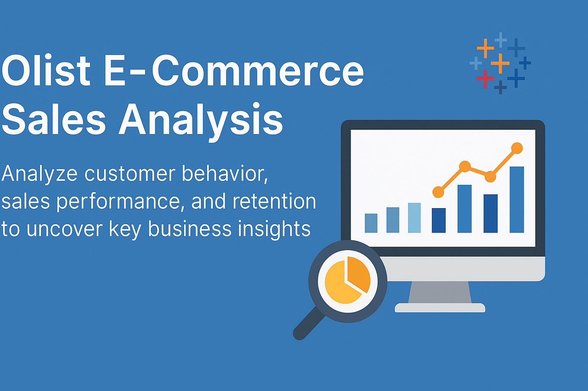
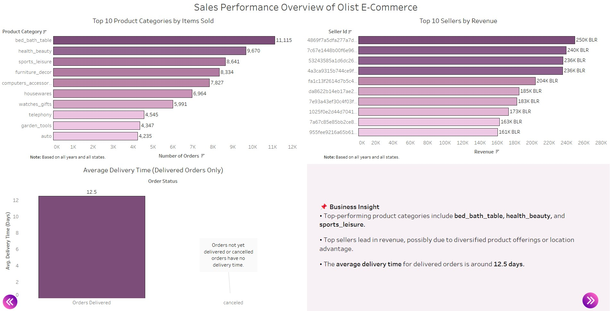
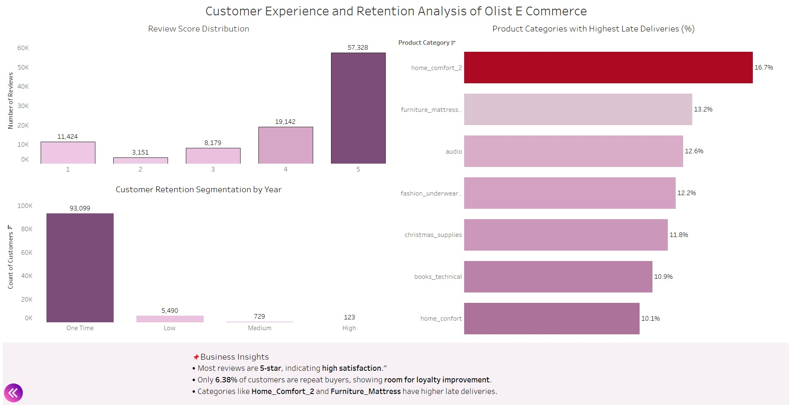

# Olist E-Commerce Sales Analysis

End-to-end data analysis project on the Olist Brazilian E-commerce dataset. Explored customer behavior, sales performance, and retention trends using SQL and Tableau to deliver actionable insights via interactive dashboards.

## 📌 Business Objective

The goal of this project is to:
- Understand customer buying patterns
- Identify sales trends over time
- Analyze delivery performance
- Perform cohort analysis to study customer retention

## 🧱 Tools & Technologies

- **SQL**: Data extraction, transformation, and complex queries
- **Python**: Python (pandas, SQLAlchemy, PyMySQL): Data loading and minor cleaning
- **Tableau**: Dashboard design and storytelling

## 🔍 Key Analyses Performed

- Cohort analysis for customer retention
- Monthly sales and order trends
- Customer segmentation by states and review scores
- Delivery time performance trends

## 📈 Tableau Dashboards
### 📊 Business Overview Dashboard

### 📊 Sales Performance Overview Dashboard

### 📊 Customer Retention Analysis Dashboard

👉 [View Interactive Dashboard](https://public.tableau.com/app/profile/avdhut.sabnis/viz/OlistE-CommerceSalesCustomerandRetentionInsights/1_DBBusinessOverview#1)
